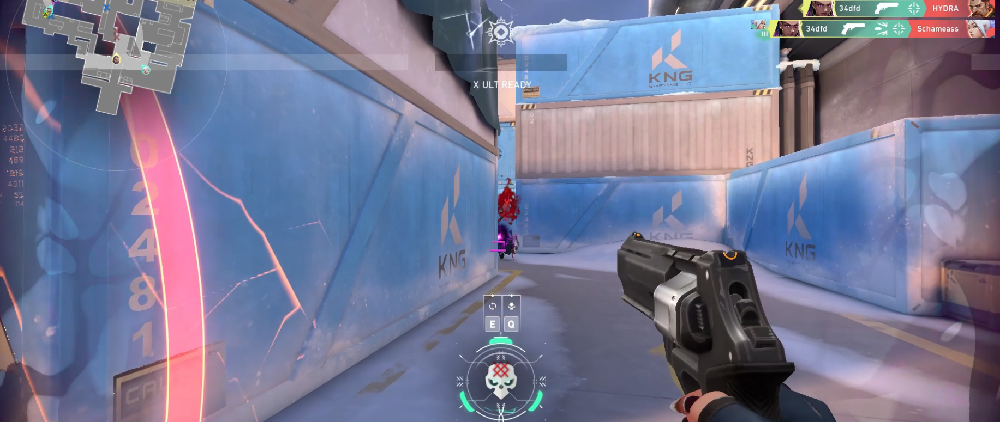

# ASM Triggerbot
This is a simple Valorant color triggerbot written in masm x86 assembly. It fires when the target color is detected at the center of the screen. The total reaction time of the triggerbot is about 10 ms.

*It no longer works because VALORANT blocked `PostMessage`.*

*For educational purposes only.*
